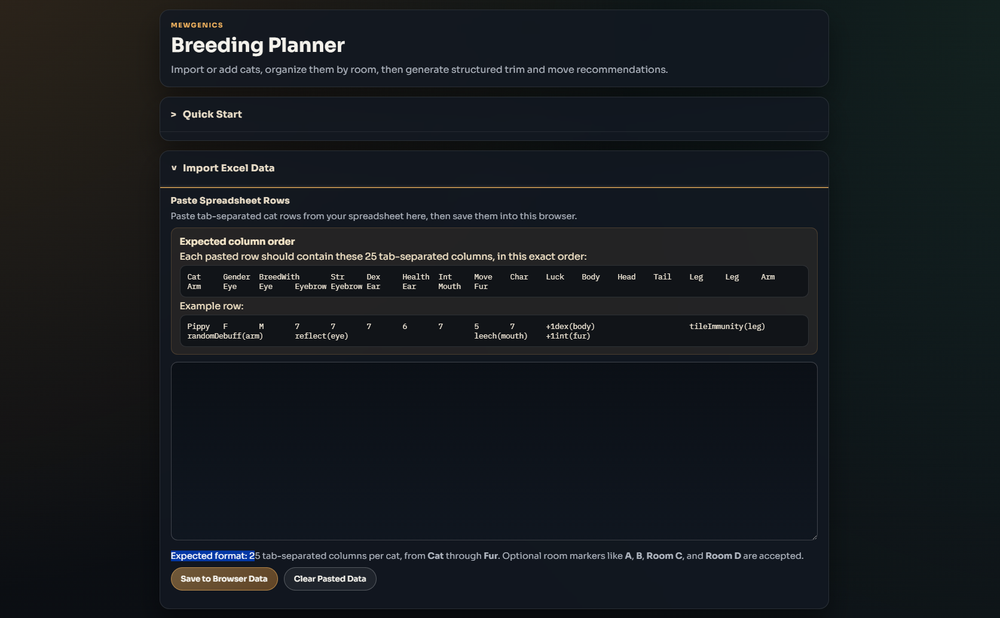
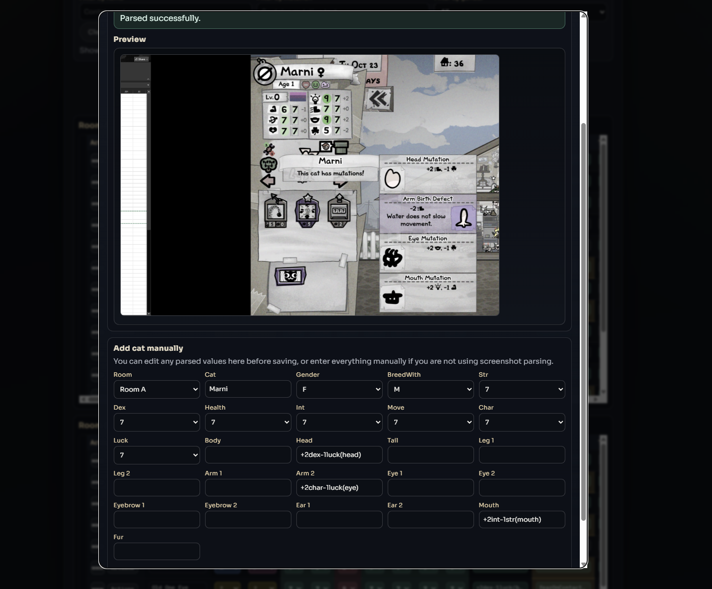
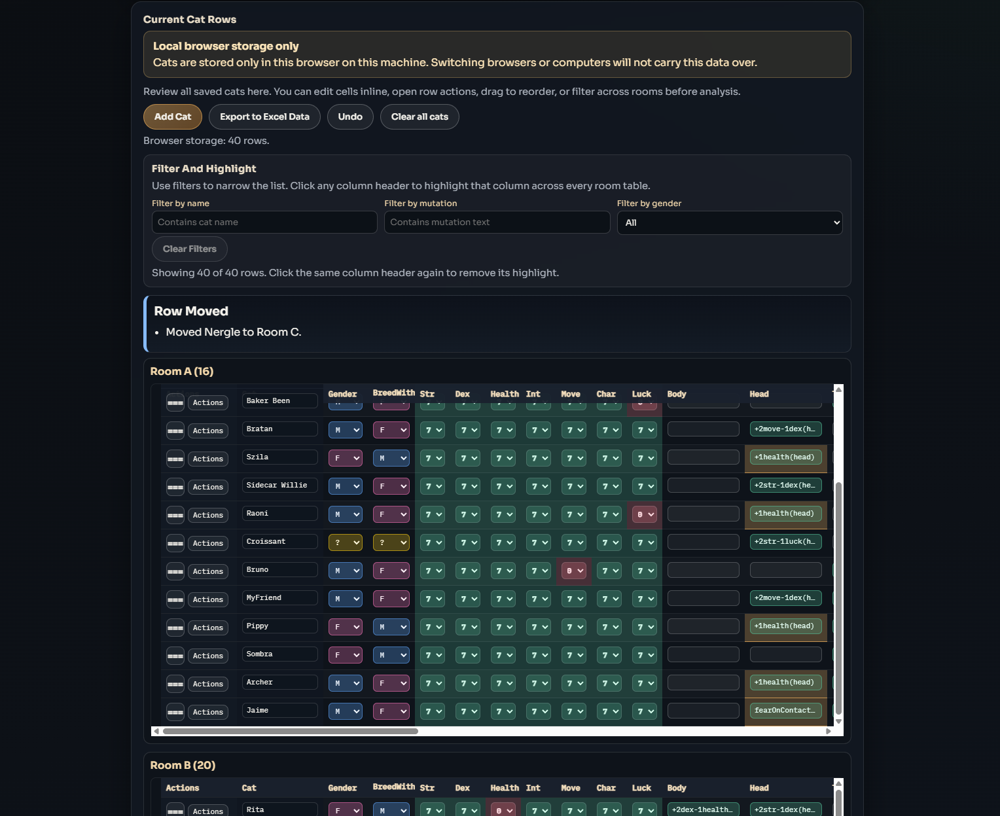
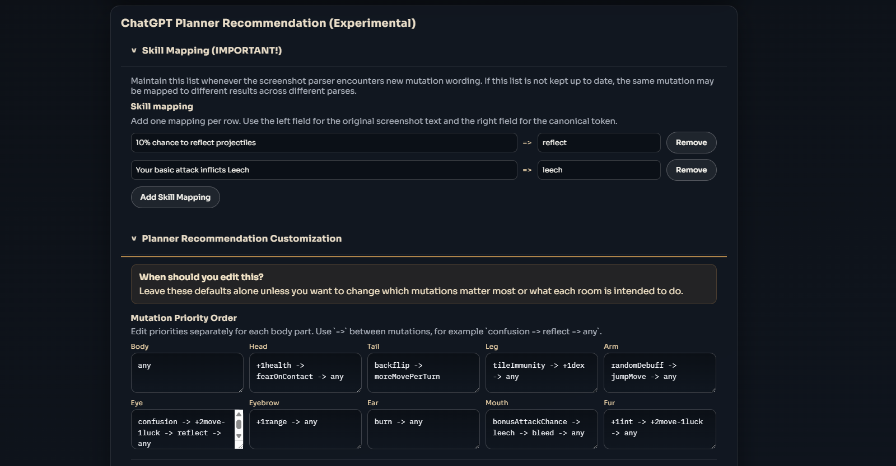
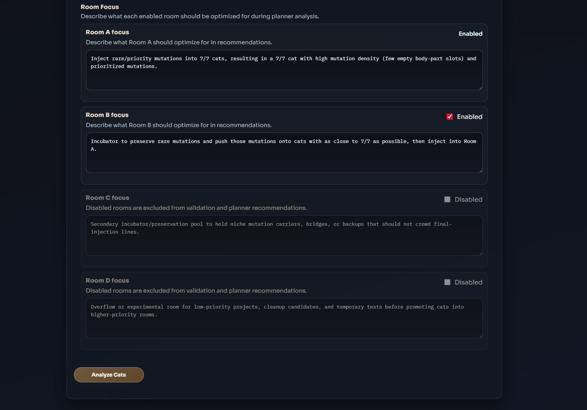
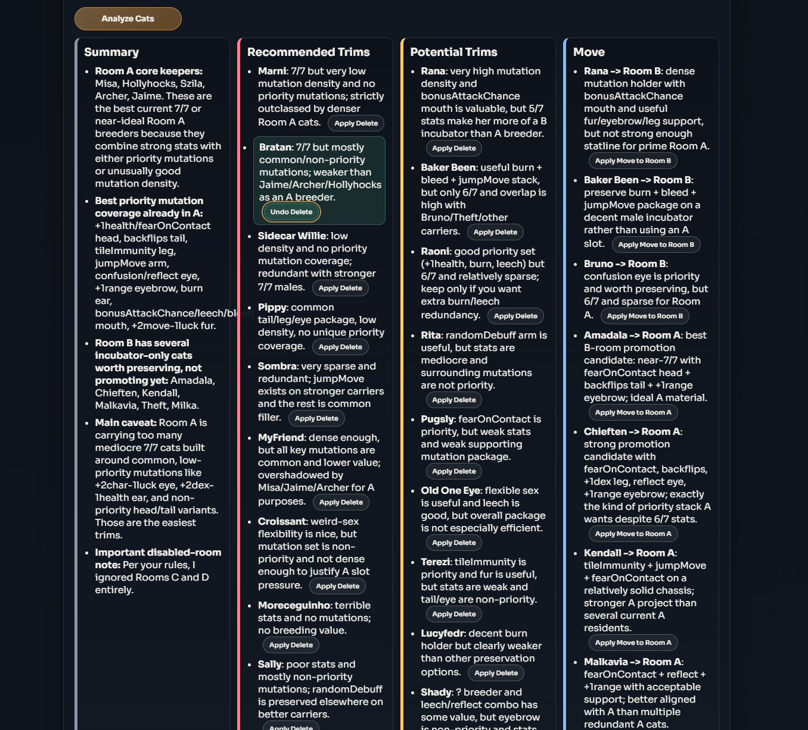

# Mewgenics Breeding Planner

A fan-made Mewgenics breeding planner with a React + TypeScript frontend and a TypeScript server for screenshot parsing and planner recommendations.

Fan-made tool only. This project is not affiliated with, sponsored by, or endorsed by Mewgenics or its creators.

## What This App Can Do

This app is designed to help you import, organize, review, and analyze Mewgenics breeding data in one place.

### 1. Import spreadsheet-style cat data

You can paste tab-separated rows directly from Excel or another spreadsheet, validate them, and save them into browser storage.



### 2. Add cats manually or from screenshots

You can add a cat by filling fields manually, or use screenshot parsing to pre-fill the form when GPT features are enabled.



### 3. Review and organize all current cats

Once cats are loaded, you can:
- edit cells inline
- filter by name, mutation text, or gender
- move or delete rows with row actions
- drag to reorder rows
- highlight columns
- see invalid mutation warnings and priority mutation highlights
- export the current data back into spreadsheet-ready text



### 4. Customize how recommendations are generated

You can control the planner by maintaining screenshot skill mappings, editing mutation priority order by body part, and defining what each room should focus on.





### 5. Generate structured recommendations

When GPT features are enabled, the app can analyze your current cats and produce:
- a summary
- recommended trims
- potential trims
- move recommendations
- follow-up prompts when more input is needed

Supported move and delete recommendations can be applied directly from the result cards, and then undone from the same output.



## Requirements

- Node.js 18+
- An OpenAI API key for screenshot parsing and planner recommendation features (optional)

## Get An OpenAI API Key

1. Sign in or create an account on the OpenAI Developer Platform.
2. Open the API keys page and create a new secret key.
3. Open the billing page, add a payment method, and add credits or configure billing.
4. Put the key in your local `.env` file.

Links:
- API keys: `https://platform.openai.com/api-keys`
- Developer quickstart: `https://platform.openai.com/docs/quickstart`
- Billing: `https://platform.openai.com/settings/organization/billing/overview`

Important:
- This project uses the OpenAI API, not just the ChatGPT web app.
- The API key stays on your local server and is not exposed to the React client.
- Do not share, commit, or post your API key.
- If you host this for other people, screenshot parsing and planner requests send user-provided data to OpenAI.

## Cost Warning

Only the OpenAI-powered features cost money:
- parsing a screenshot
- running a recommendation
- sending a follow-up recommendation request

All other features are local and do not cost money, including:
- importing spreadsheet rows
- editing cat rows
- moving, deleting, dragging, and undoing rows
- filtering, highlighting, and organizing current cat rows
- changing planner customization fields
- storing cat data in local browser storage on the current machine only

Rough cost estimates for the current codebase are:
- screenshot parse: about `$0.005` to `$0.015` per image
- recommendation run: about `$0.01` to `$0.04` per analysis
- follow-up recommendation: usually about `$0.01` to `$0.05` each

These are estimates, not fixed prices. Actual cost depends on:
- the current model price
- screenshot size and image detail level
- how many cat rows you send
- how long the model's response is

## Install

1. Install Node.js from the official site:

- Node.js downloads: `https://nodejs.org/`

2. Verify the install:

```powershell
node --version
npm --version
```

3. Install dependencies from the project root:

```powershell
npm install
```

4. Create your local environment file from the template:

```powershell
Copy-Item .env.example .env
```

5. Edit `.env` and set your real API key if you want GPT-powered features:

```env
OPENAI_API_KEY=your_real_openai_api_key
```

Optional:
- if you want to override the default local port, edit [config/app-config.json](config/app-config.json)

If you do not set a valid API key:
- the app still starts
- spreadsheet import and local cat editing still work
- screenshot parsing is locked
- ChatGPT planner recommendation is locked

## Build And Run

Start the TypeScript server:

```powershell
npm start
```

`npm start` automatically runs `npm run build` first, then starts the server in the foreground and keeps the terminal attached to it.

If you only want to rebuild the frontend manually:

```powershell
npm run build
```

Stop it with:

```powershell
Ctrl+C
```

If you want the server in the background instead:

```powershell
npm run start:bg
```

To stop the background server:

```powershell
npm run stop
```

If there is no PID file, `npm run stop` also falls back to stopping whatever is listening on the configured server port (default: `38147`).

Background server output is written to `.mewgenics-server.log`.

The app runs at `http://127.0.0.1:38147/planner` by default.

You can override the default port in [config/app-config.json](config/app-config.json).

## Development

If you want to work on the frontend and backend separately:

1. Run the backend in one terminal:

```powershell
npm run dev:server
```

2. Run the Vite frontend in another terminal:

```powershell
npm run dev
```

3. Open the Vite URL shown in the terminal, usually `http://127.0.0.1:5173/`.

The Vite dev server proxies planner API requests to the backend port from [config/app-config.json](config/app-config.json), or `38147` if that file is missing or invalid.

## How To Use

### 1. Open the planner

Go to `http://127.0.0.1:38147/planner` after starting the server, unless you changed the port in [config/app-config.json](config/app-config.json).

### 2. Add cat data

You can add cats in two ways:
- Paste spreadsheet rows into `Import Excel Data`, then click `Save to Browser Data`
- Click `Add Cat` and either fill out the fields manually or paste/upload a screenshot for parsing

Expected import format:
- tab-separated rows
- 25 columns per cat
- optional room labels such as `A`, `B`, `C`, `D`, `Room A`, and similar variants

### 3. Review and organize current cats

After saving data, `Current Cat Rows` shows the cats stored in this browser only. From there you can:
- edit cells inline
- use the row `Actions` menu to move cats between rooms or delete them
- drag to reorder rows or move them between rooms
- delete cats
- undo recent row actions
- filter across all rooms by name, mutation text, or gender
- click a column header to highlight that column across every room table
- click a row to keep it selected/highlighted
- see gold highlights for mutations that match your configured priority order
- see inline red highlights on invalid mutation cells that need correction before analysis

Important:
- cat data is stored only in the current browser on the current machine
- switching browsers or moving to another computer will not bring that stored data with you

### 4. Maintain skill mappings

Inside `ChatGPT Planner Recommendation`, expand `Skill Mapping (IMPORTANT!)` when needed.

Each mapping row contains:
- original screenshot text
- mapped token

Example mappings:
- `10% chance to reflect projectiles => reflect`
- `Your basic attack inflicts Leech => leech`

This list should be maintained whenever the screenshot parser encounters new wording. Otherwise the same mutation may be mapped to different tokens across different parses.

### 5. Customize recommendation inputs

Inside `Planner Recommendation Customization`, you can edit:
- mutation priority order
- Room A focus
- Room B focus
- Room C focus
- Room D focus

Additional planner behavior:
- mutation priority order is split by body part in the UI
- Room B, Room C, and Room D can be enabled or disabled individually
- disabled rooms are excluded from planner validation and recommendations

If you leave those fields alone, the app uses the backend defaults.

### 6. Analyze cats

Click `Analyze Cats` to send the normalized cat data and planner settings to the server.

The response is streamed live first, then rendered into structured sections such as:
- summary
- recommended trims
- potential trims
- move
- planner follow-up, if the model asks for more input

For supported move/delete recommendations, the UI also shows `Apply` buttons that can update the current cat rows directly. After applying one, the recommendation can be undone from the same card without rerunning analysis.

### 7. Continue with follow-up requests

If the planner returns a follow-up prompt, type your response in the follow-up box and submit it. The app sends the previous analysis back along with your reply so the next response stays in the same structure.

## Notes

- Cat rows are stored in browser `localStorage`, not in a database.
- That means your saved cats stay on this browser and this machine only.
- The default local server port is configured in [config/app-config.json](config/app-config.json).
- Screenshot parsing and planner analysis both require a valid OpenAI API key.
- If the API key is missing or invalid, GPT-powered sections are visually locked and disabled in the UI.
- Pasting an image into the page only auto-starts screenshot parsing when GPT features are available.
- The optional `/save` endpoint appends rows to `cats.csv`, which is ignored by git.
- This is a fan-made tool and is not affiliated with or endorsed by Mewgenics or its creators.

## Public Repo And Hosting Notes

Before making the repo public:
- review the git history and rotate any secret that may ever have been committed
- avoid uploading official Mewgenics logos, art, or other copyrighted assets unless you have permission
- keep the fan-made/non-affiliation disclaimer in the repo and UI
- understand that using the `Mewgenics` name may still carry trademark or branding risk even with a disclaimer

If you plan to host the app publicly:
- add a public privacy policy that discloses OpenAI processing for screenshot parsing and planner recommendations
- disclose any server-side logging or retention you keep
- disable or document the optional `/save` endpoint if it writes user data to `cats.csv`

Repository documents:
- License: [LICENSE](LICENSE)
- Privacy template for hosted deployments: [PRIVACY.md](PRIVACY.md)
